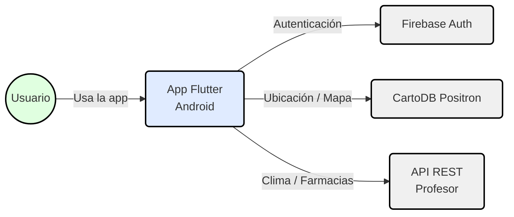
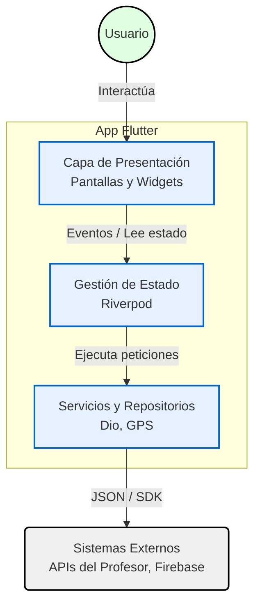

# Farmacias de Turno GPS 🏥🗺️

Aplicación móvil multiplataforma desarrollada en Flutter para la asignatura de Computación Móvil. Su objetivo es ayudar al usuario a encontrar la farmacia de turno más cercana a su ubicación actual, considerando además las condiciones climáticas locales.

## 🚀 Características Principales
- **Autenticación Segura:** Acceso exclusivo mediante Google Sign-In (Firebase Auth) con persistencia de sesión.
- **Geolocalización en Tiempo Real:** Obtención de coordenadas mediante el sensor GPS del dispositivo.
- **Mapas Interactivos 100% Gratuitos:** Renderizado de mapas utilizando `flutter_map` y mosaicos de CartoDB Positron.
- **Auto-Búsqueda:** Búsqueda automática de la farmacia más cercana al detectar la ubicación inicial.
- **Navegación Asistida:** Botones dedicados para abrir la dirección de la farmacia directamente en Google Maps o Waze.

---

## 📖 Guía de Uso Rápido

La aplicación está diseñada para requerir la menor cantidad de interacciones posibles por parte del usuario:

1. **Inicio de Sesión:** Al abrir la app, ingresa con tu cuenta de Google.
2. **Auto-Búsqueda:** Una vez concedidos los permisos de ubicación, la app detectará tu posición actual y consultará automáticamente la API para encontrar la farmacia de turno más cercana.
3. **Explorar el Mapa:** Verás pines verdes correspondientes a todas las farmacias que están de turno a nivel nacional y un pin especial parpadeante indicando la farmacia de turno más cercana a ti. Al tocar cualquier pin verde, se desplegará una tarjeta flotante con la información detallada (nombre, dirección, horario y teléfono).
4. **Botón Flotante Rojo (Búsqueda Manual):** Ubicado en la esquina inferior derecha. Si sospechas que el estado de los turnos cambió o deseas forzar a la app a que vuelva a consultar tu farmacia más cercana desde cero, presiona este botón para limpiar la caché y lanzar una nueva petición a la API.
5. **Botón Flotante Blanco (Centrar):** Te devuelve inmediatamente a tu ubicación GPS actual en el mapa.
6. **Navegación Externa:** Dentro de la tarjeta flotante de la farmacia, encontrarás botones para copiar la dirección al portapapeles o abrir la ruta en **Google Maps** / **Waze**.

---

## 🏛️ Arquitectura del Sistema

El proyecto está diseñado bajo los principios de **Clean Architecture**, aplicando una separación estricta mediante el patrón **Feature-First** (agrupación por funcionalidades como `auth`, `mapa`, `farmacias`). 

Para la **Gestión de Estado**, se utiliza **Riverpod** (`NotifierProvider`), logrando un flujo de datos reactivo y unidireccional. La capa de presentación (UI) es completamente agnóstica a la lógica de negocio y consumo de APIs.

### Diagrama de Contexto (Nivel 1)
Describe la interacción de alto nivel entre el usuario, la aplicación y los sistemas externos.



### Diagrama de Contenedores (Nivel 2)
Detalla la estructura interna de la aplicación Flutter y el flujo de los datos.




## 🛠️ Instrucciones de Instalación y Ejecución

Para compilar y ejecutar este proyecto en tu entorno local, sigue estos pasos:

### 1. Requisitos Previos
- Tener instalado [Flutter SDK](https://docs.flutter.dev/get-started/install) (Mínimo versión 3.12.0).
- Un emulador de Android (SDK Min 21) o un dispositivo físico conectado.
- Git instalado.

### 2. Clonar el repositorio
```bash
git clone https://github.com/Ezequielito1013/app_farmacias_turno_gps.git
cd app_farmacias_turno_gps
```

### 3. Descargar dependencias
```bash
flutter pub get
```

### 4. Ejecutar la aplicación
Asegúrate de tener un emulador abierto o un dispositivo conectado, y ejecuta:
```bash
flutter run
```

### ⚠️ Nota sobre Firebase (Google Sign-In) y Revisión Académica

Debido a las estrictas políticas de seguridad de Google, el inicio de sesión con Google Sign-In bloquea cualquier compilación local cuya huella digital de desarrollo (SHA-1) no esté explícitamente autorizada en la consola de Firebase original. 

Para facilitar la revisión de este proyecto **sin** necesidad de intercambiar claves SHA-1, se proponen dos opciones:

1. **Recomendado (Vía Rápida):** Instalar directamente el **APK pre-compilado** que se ha dejado disponible en la sección de *Releases* del repositorio. Al estar firmado por el autor original, el Google Sign-In funcionará instantáneamente en el emulador o dispositivo del profesor.
2. **Compilación desde Código Fuente:** Si como evaluador deseas compilar el código desde cero en tu máquina (`flutter run`), deberás crear temporalmente tu propio proyecto de Firebase, habilitar Google Authentication, registrar la app (`ezekim.farmaciasgps`) y descargar tu propio archivo `google-services.json` para pegarlo dentro de la carpeta `android/app/`. De lo contrario, el SDK de Google arrojará la excepción `PlatformException(sign_in_failed)`.